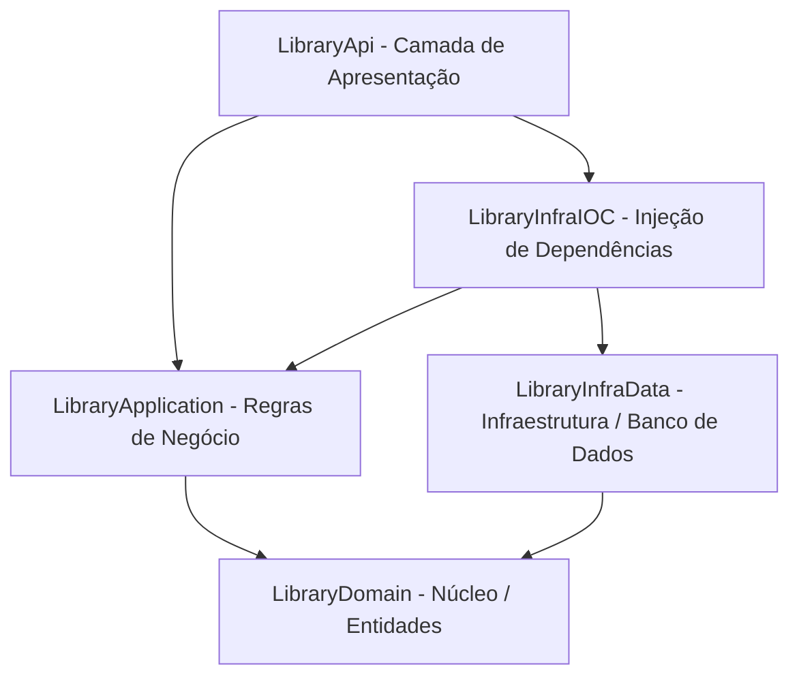

# 📚 Library API

Uma API desenvolvida em **C#** e **ASP.NET Core 10** para a gestão de uma biblioteca (controle de livros, autores, categorias, empréstimos e usuários). A solução adota princípios de **Clean Architecture** (Arquitetura Limpa) para garantir separação de responsabilidades, testabilidade e facilidade de manutenção.

---

## 🏛️ Arquitetura do Projeto

A solução está dividida em camadas bem definidas, seguindo o padrão de Clean Architecture:



### Detalhamento das Camadas

*   **[LibraryDomain](file:///c:/Users/suellen.v.da.silva/Documents/Library%20-%20Copia/LibraryDomain)**: Contém as entidades de domínio, regras fundamentais de negócio e as interfaces dos repositórios (`IAuthor`, `IBook`, `ICategory`, `ILoan`, `IUser`) e autenticação (`IAuthenticate`). Não possui dependência de nenhuma outra camada ou framework.
*   **[LibraryApplication](file:///c:/Users/suellen.v.da.silva/Documents/Library%20-%20Copia/LibraryApplication)**: Contém as regras de aplicação, serviços (`BookServices`, `AuthorService`, `LoansServices`, `UserService`), interfaces dos serviços e os Objetos de Transferência de Dados (DTOs). Depende apenas da camada *Domain*.
*   **[LibraryInfraData](file:///c:/Users/suellen.v.da.silva/Documents/Library%20-%20Copia/LibraryInfraData)**: Camada de infraestrutura de dados. Contém a implementação dos repositórios, configurações do Entity Framework Core (`ApplicationDbContext`), mapeamento das entidades e migrações do banco de dados. Depende de *Domain*.
*   **[LibraryInfraIOC](file:///c:/Users/suellen.v.da.silva/Documents/Library%20-%20Copia/LibraryInfraIOC)**: Camada de IoC (Inversão de Controle) responsável pela injeção de dependências. Configura o banco de dados PostgreSQL e o middleware de autenticação JWT Bearer. Depende de todas as camadas inferiores para orquestrar as dependências.
*   **[LibraryApi](file:///c:/Users/suellen.v.da.silva/Documents/Library%20-%20Copia/LibraryApi)**: Ponto de entrada da aplicação ASP.NET Core Web API. Contém os controladores HTTP (`Controllers`), middlewares customizados (como tratamento global de exceções) e configurações do Swagger com suporte a autenticação por Token Bearer.

---

## 🛠️ Tecnologias Utilizadas

*   **Linguagem:** C# 13 / .NET 10.0
*   **Framework Web:** ASP.NET Core Web API
*   **Banco de Dados & ORM:** PostgreSQL / Entity Framework Core (v10.0.8) & Npgsql.EntityFrameworkCore.PostgreSQL (v10.0.1)
*   **Autenticação:** JWT Bearer (Token de segurança)
*   **Documentação da API:** OpenAPI / Swagger (Swashbuckle.AspNetCore v7.2.0)

---

## ⚙️ Configuração e Execução

### Pré-requisitos
*   **SDK do .NET 10.0** instalado.
*   **PostgreSQL** instalado e em execução (ou container Docker rodando).

### 1. Clonar e Acessar o Projeto 

### 2. Configurar a String de Conexão e JWT
No arquivo `appsettings.json` do projeto **[LibraryApi](file:///c:/Users/suellen.v.da.silva/Documents/Library%20-%20Copia/LibraryApi/appsettings.json)**, configure a conexão do banco de dados PostgreSQL (`DefaultConnection`) e a chave secreta de autenticação do JWT:

```json
"ConnectionStrings": {
  "DefaultConnection": "User ID=SEU_USUARIO;Password=SUA_SENHA;Host=localhost;Port=5432;Database=librarydb;"
},
"Jwt": {
  "SecretKey": "MinhaChaveSuperSecretaComMaisDe32Caracteres123",
  "Issuer": "your_issuer_here",
  "Audience": "your_audience_here",
  "ExpirationMinutes": 60
}
```

### 3. Rodar as Migrações do Banco de Dados
Para criar a estrutura de tabelas no PostgreSQL com base nas migrações já existentes, execute o comando abaixo a partir da raiz do projeto:

```bash
dotnet ef database update --project LibraryInfraData --startup-project LibraryApi
```

> [!NOTE]
> Certifique-se de possuir a ferramenta global `dotnet-ef` instalada. Caso precise instalá-la ou atualizá-la, use:
> `dotnet tool install --global dotnet-ef`

### 4. Executar a Aplicação
Inicie a API executando o seguinte comando na pasta raiz do projeto:

```bash
dotnet run --project LibraryApi
```

A API ficará disponível por padrão nos endereços:
*   **HTTP:** `http://localhost:5258`
*   **HTTPS (se configurado):** `https://localhost:7136`
*   **Swagger UI:** `http://localhost:5258/swagger`

---

## 🔒 Autenticação JWT

A maioria dos endpoints da API é protegida e exige autenticação. Para consumi-los, você deve:

1.  Registrar um usuário em `POST /api/User`.
2.  Obter o token JWT de acesso fazendo login em `POST /api/User/login` enviando os parâmetros `email` e `password`.
3.  Enviar o token recebido no cabeçalho de todas as requisições subsequentes:
    ```http
    Authorization: Bearer <SEU_TOKEN_JWT>
    ```
4.  No **Swagger**, você pode clicar no botão **Authorize**, digitar `Bearer <SEU_TOKEN>` e confirmar para realizar os testes de forma interativa.

---

## 📞 Endpoints da API

Abaixo estão listados os principais endpoints expostos pelos controladores da aplicação.

### 👤 Usuários e Autenticação (`UserController`)
Gerenciamento de contas e geração de tokens.

*   `POST /api/User` - Cadastra um novo usuário no sistema. *(Livre)*
*   `POST /api/User/login?email={email}&password={password}` - Realiza login e retorna o Token JWT. *(Livre)*
*   `GET /api/User/{id}` - Retorna os detalhes de um usuário por ID. *(Requer autenticação)*

### 📚 Livros (`BookController`)
Consulta ao acervo de livros da biblioteca.

*   `GET /api/Book` - Lista todos os livros cadastrados. *(Requer autenticação)*
*   `GET /api/Book/{id}` - Obtém detalhes de um livro específico pelo seu ID. *(Requer autenticação)*

### ✍️ Autores (`AuthorController`)
Consulta aos autores cadastrados.

*   `GET /api/Author` - Lista todos os autores cadastrados. *(Requer autenticação)*
*   `GET /api/Author/{id}` - Obtém um autor específico por ID. *(Requer autenticação)*

### 🤝 Empréstimos (`LoanController`)
Controle de empréstimos e devoluções.

*   `POST /api/Loan` - Registra um novo empréstimo de livro para um usuário. *(Requer autenticação)*
*   `PUT /api/Loan/{id}` - Atualiza um empréstimo existente (ex: marcar devolução). *(Requer autenticação)*
*   `GET /api/Loan/user/{userId}` - Retorna todos os empréstimos associados a um usuário específico. *(Requer autenticação)*
*   `GET /api/Loan/boo/{bookId}` - Consulta o status de empréstimo de um livro específico. *(Requer autenticação)*